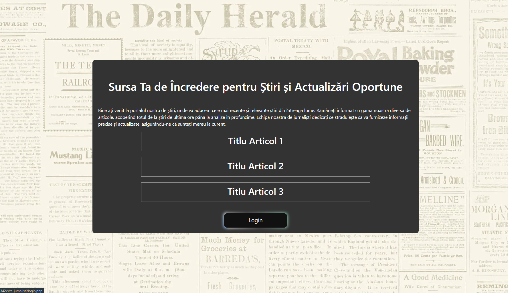

# Proiect: Proiectarea și Realizarea Site-urilor Web

Bine ați venit în proiectul pentru materia "
Proiectare și Realizare a site-urilor Web!"

 
Acest proiect a fost dezvoltat de către:
- **Dicu Cristian**

## Descriere

Proiectul nostru se concentrează pe proiectarea și dezvoltarea unui site web în PHP, axându-ne pe tehnica de programare orientată pe obiect (OOP). Site-ul gestionează o echipă de jurnaliști care pot încărca articole pe categoriile arondate lor. Editorul validează și aprobă articolele pentru a fi afișate pe site. Articolele sunt grupate pe categorii precum artistic, tehnic, științific și modă.

## Captură de ecran

## Cum să rulezi proiectul

1. Clonează acest repository.
2. Configurează un server web local (de exemplu, XAMPP sau WAMP).
3. Copiază fișierele în directorul radacina al serverului.
4. Deschide index.php în browser.

